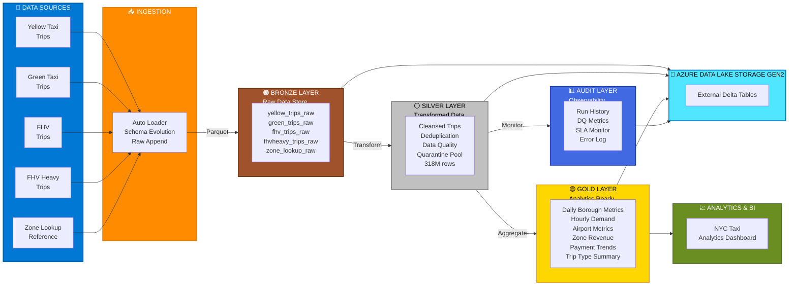

# 🚕 NYC Taxi Medallion Pipeline — Production (External Tables)

> **A production-grade, medallion-architecture data pipeline processing 318M+ NYC taxi records across 4 taxi types with enterprise observability, data quality enforcement, and quarantine workflows — all on external Delta tables stored in Azure Data Lake Storage Gen2.**

---

## 📌 Overview

This pipeline ingests, cleanses, and aggregates NYC Taxi &amp; Limousine Commission (TLC) trip data using the **Databricks Lakeflow Spark Declarative Pipelines** framework. It processes Yellow, Green, FHV (For-Hire Vehicle), and High-Volume FHV (Uber/Lyft) trip records through a classic **Bronze → Silver → Gold** medallion architecture with full audit trail and quarantine workflows.

| Metric | Value |
| --- | --- |
| Total Records Ingested | 318,000,000+ |
| Silver Layer Output | 293,500,000 rows |
| Data Quality Drops | 23,174,000 rows (quarantined) |
| Gold Analytics Tables | 6 materialized views |
| Audit/Observability Tables | 5 materialized views |
| Source File Format | Parquet (ADLS Gen2) |
| Target Storage | External Delta Tables |

---

## 🏗️ Architecture



---

## 📂 Project Structure

```
nyc_taxi_medallion_pipeline/
├── databricks.yml                     ← Asset Bundles config (pipeline + dashboard + jobs)
├── README.md                          ← You are here
├── dashboards/
│   └── nyc_taxi_analytics.lvdash.json ← Exported AI/BI dashboard definition
├── maintenance/
│   └── table_maintenance              ← OPTIMIZE + VACUUM + quarantine purge notebook
├── .github/
│   └── workflows/
│       └── deploy.yml                 ← CI/CD: validate → deploy pipeline + dashboard
├── transformations/
│   ├── _config.py                     ← Centralized configuration (paths, properties)
│   ├── bronze/
│   │   ├── yellow_trips_raw.py        ← Auto Loader: Yellow taxi parquet ingestion
│   │   ├── green_trips_raw.py         ← Auto Loader: Green taxi parquet ingestion
│   │   ├── fhv_trips_raw.py           ← Auto Loader: FHV parquet ingestion
│   │   ├── fhvheavy_trips_raw.py      ← Auto Loader: High-volume FHV (243M rows)
│   │   └── zone_lookup_raw.py         ← Static reference data (265 zones)
│   ├── silver/
│   │   ├── yellow_trips.py            ← Cleansed + deduplicated yellow trips
│   │   ├── green_trips.py             ← Cleansed + deduplicated green trips
│   │   ├── fhv_trips.py               ← Cleansed + deduplicated FHV trips
│   │   ├── fhvheavy_trips.py          ← Cleansed + deduplicated FHV heavy trips
│   │   ├── zone_lookup.py             ← Standardized zone reference
│   │   └── quarantine_trips.py        ← DQ-failed rows from all taxi types
│   ├── gold/
│   │   ├── daily_borough_metrics.py   ← Daily revenue and trips by borough
│   │   ├── hourly_demand.py           ← Demand patterns by hour/day/borough
│   │   ├── airport_metrics.py         ← JFK, LaGuardia, Newark trip analysis
│   │   ├── zone_revenue.py            ← Revenue by pickup zone
│   │   ├── payment_trends.py          ← Payment method trends
│   │   └── trip_type_summary.py       ← Street-hail vs dispatch analysis
│   └── audit/
│       └── audit_views.py             ← 5 MVs: run_log, dq_log, row_count, SLA, errors
```

---

## 🚀 Quick Start

### Prerequisites

1. **Databricks Workspace** with Unity Catalog enabled
2. **Azure Storage Account** (`${var.storage_account_name}`) with containers: `bronze`, `silver`, `gold`
3. **External Location** configured in Unity Catalog for ADLS access
4. **Catalog and Schemas** created:

```sql
CREATE CATALOG IF NOT EXISTS nyctaxi_databricks;
CREATE SCHEMA IF NOT EXISTS nyctaxi_databricks.bronze;
CREATE SCHEMA IF NOT EXISTS nyctaxi_databricks.silver;
CREATE SCHEMA IF NOT EXISTS nyctaxi_databricks.gold;
CREATE SCHEMA IF NOT EXISTS nyctaxi_databricks.audit;
```

### Configure External Storage Locations

```sql
ALTER SCHEMA nyctaxi_databricks.bronze SET MANAGED LOCATION
  'abfss://bronze@${var.storage_account_name}.dfs.core.windows.net/tables';
ALTER SCHEMA nyctaxi_databricks.silver SET MANAGED LOCATION
  'abfss://silver@${var.storage_account_name}.dfs.core.windows.net';
ALTER SCHEMA nyctaxi_databricks.gold SET MANAGED LOCATION
  'abfss://gold@${var.storage_account_name}.dfs.core.windows.net';
ALTER SCHEMA nyctaxi_databricks.audit SET MANAGED LOCATION
  'abfss://silver@${var.storage_account_name}.dfs.core.windows.net/_audit';
```

### Deploy Pipeline

**Option A: Databricks Asset Bundles (Recommended for CI/CD)**

```yaml
# databricks.yml
bundle:
  name: "nyc-taxi-medallion-pipeline"

workspace:
  host: "<YOUR AZURE DATABRICKS URL>"

resources:
  pipelines:
    nyc_taxi_medallion:
      name: "NYC Taxi Medallion Pipeline - Production (External Tables)"
      catalog: "nyctaxi_databricks"
      schema: "default"
      photon: true
      serverless: false
      continuous: false
      development: false
      libraries:
        - glob:
            include: "transformations/**"
      clusters:
        - label: "default"
          autoscale:
            min_workers: 2
            max_workers: 10
            mode: "ENHANCED"
      notifications:
        - email_recipients: ["<YOUR AZURE ACCOUNT MAIL ID>"]
          alerts: ["on-update-failure", "on-update-fatal-failure"]
        - email_recipients: ["<YOUR AZURE ACCOUNT MAIL ID>"]
          alerts: ["on-flow-failure"]
      tags:
        env: "production"
        team: "data-engineering"
        project: "nyc-taxi-medallion"
        cost_center: "data-platform"

  dashboards:
    nyc_taxi_analytics:
      display_name: "NYC Taxi Medallion Pipeline - Analytics Dashboard"
      file_path: "./dashboards/nyc_taxi_analytics.lvdash.json"
      warehouse_id: "${var.warehouse_id}"
      permissions:
        - group_name: "data-engineering"
          level: "CAN_VIEW"

  jobs:
    monthly_pipeline_update:
      name: "NYC Taxi - Monthly Pipeline Update"
      schedule:
        quartz_cron_expression: "0 0 2 1 * ? *"
        timezone_id: "Asia/Kolkata"
      email_notifications:
        on_failure: ["<YOUR AZURE ACCOUNT MAIL ID>"]
      tasks:
        - task_key: "pipeline_update"
          pipeline_task:
            pipeline_id: "${resources.pipelines.nyc_taxi_medallion.id}"

    monthly_maintenance:
      name: "NYC Taxi - Monthly Maintenance"
      schedule:
        quartz_cron_expression: "0 0 2 2 * ? *"
        timezone_id: "Asia/Kolkata"
      email_notifications:
        on_failure: ["<YOUR AZURE ACCOUNT MAIL ID>"]
      tasks:
        - task_key: "table_maintenance"
          notebook_task:
            notebook_path: "./maintenance/table_maintenance"
          new_cluster:
            spark_version: "15.4.x-scala2.12"
            num_workers: 0
            node_type_id: "Standard_DS3_v2"

variables:
  warehouse_id:
    description: "SQL Warehouse ID for the analytics dashboard"
```

**Export Dashboard for Git:**

```bash
# Export the published dashboard to lvdash.json format
databricks dashboards get 01f14a855f48112fbeb3964f95dced85 \
  --output-file ./dashboards/nyc_taxi_analytics.lvdash.json

# Deploy the full bundle (pipeline + dashboard + jobs)
databricks bundle validate
databricks bundle deploy --target production
```

**GitHub Actions CI/CD (`.github/workflows/deploy.yml`):**

```yaml
name: Deploy NYC Taxi Pipeline
on:
  push:
    branches: [main]
jobs:
  deploy:
    runs-on: ubuntu-latest
    steps:
      - uses: actions/checkout@v4
      - uses: databricks/setup-cli@main
      - run: databricks bundle validate
        env:
          DATABRICKS_HOST: ${{ secrets.DATABRICKS_HOST }}
          DATABRICKS_TOKEN: ${{ secrets.DATABRICKS_TOKEN }}
      - run: databricks bundle deploy --target production
        env:
          DATABRICKS_HOST: ${{ secrets.DATABRICKS_HOST }}
          DATABRICKS_TOKEN: ${{ secrets.DATABRICKS_TOKEN }}
```

**Option B: Manual Setup**

1. Create a new Lakeflow Declarative Pipeline in the Databricks workspace
2. Set catalog to `nyctaxi_databricks`, schema to `default`
3. Add source: `transformations/**` glob pattern
4. Enable Photon, set development mode to OFF
5. Run pipeline update

---

## 🛡️ Data Quality Strategy

### Two-Tier Enforcement (Silver Layer)

| Tier | Action | Use Case |
| --- | --- | --- |
| **Critical (DROP)** | Rows removed from output | NULL timestamps, invalid locations, impossible durations, unreasonable fares |
| **Monitoring (ALLOW)** | Rows kept, metrics tracked | Suspicious passenger counts, unusual distances, zero fares |

### Critical Rules Applied

```
✗ NULL pickup/dropoff datetime          → DROP
✗ Location ID outside [1, 265]          → DROP
✗ Trip duration < 0 or > 1440 min       → DROP
✗ Pickup date outside [2024-01-01, 2027-01-01]  → DROP
✗ Fare < $0 or >= $10,000              → DROP
✗ Total < $0 or >= $50,000             → DROP
```

### Quarantine Workflow

Rows that fail critical DQ rules are **not lost** — they are captured in `silver.quarantine_trips` with:

- Original pickup/dropoff timestamps and locations
- `taxi_type` identifier
- `quarantine_reason` (comma-separated list of all violations)
- `_quarantined_at` timestamp

This enables data stewards to investigate, remediate, and replay corrected records.

---

## ⚡ Performance Optimizations

| Optimization | Where Applied | Rationale |
| --- | --- | --- |
| **Photon Engine** | Pipeline-wide | 2-5x acceleration for SQL/DataFrame workloads |
| **Liquid Clustering** | All gold tables | Query-aligned clustering without manual Z-ordering |
| **Auto Loader** | All bronze tables | Incremental file discovery, exactly-once ingestion |
| **Watermark Deduplication** | All silver streaming tables | 24-hour window, memory-efficient stateful dedup |
| **Enhanced Autoscaling** | Cluster config (2-10 workers) | Elastic compute for variable workloads |
| **Partition Pruning** | Silver tables | `[taxi_type, pickup_year, pickup_month]` partitioning |
| **Adaptive Query Execution** | Spark config | Dynamic partition coalescing and skew handling |
| **Schema Evolution** | Bronze Auto Loader | `addNewColumns` mode handles upstream schema drift |

---

## 🔍 Observability and Monitoring

### Audit Layer (5 Materialized Views)

| View | Purpose |
| --- | --- |
| `audit.pipeline_run_log` | Update execution history with duration and state |
| `audit.data_quality_log` | Expectation pass/fail rates per dataset per update |
| `audit.row_count_log` | Throughput metrics — rows written per dataset |
| `audit.sla_monitoring` | Freshness compliance against thresholds (bronze: 6h, silver: 12h, gold: 24h) |
| `audit.error_log` | Error events with classification and severity |

### Alerting

- **Email notifications** on update failure, fatal failure, and flow failure
- **SLA thresholds** tracked per layer (configurable in audit views)
- **Change Data Feed** enabled on all tables for downstream CDC consumers

---

## 🏷️ Governance and Metadata

Every table includes governance metadata via table properties:

```python
{
    "quality_tier": "bronze | silver | gold | quarantine | audit",
    "data_owner": "data-engineering-team | analytics-team",
    "sla_freshness_hours": "6 | 12 | 24",
    "retention_days": "90 | 365 | 1095",
    "source_system": "nyc_tlc_adls",
}
```

### Gold Layer — BI Compatibility

All gold tables define **PRIMARY KEY constraints** for BI tool auto-detection:

| Table | Primary Key |
| --- | --- |
| `daily_borough_metrics` | (trip_date, borough, taxi_type) |
| `hourly_demand` | (hour_of_day, day_of_week, borough, taxi_type) |
| `airport_metrics` | (trip_date, taxi_type) |
| `zone_revenue` | (pickup_location_id, taxi_type) |
| `payment_trends` | (trip_date, payment_type, taxi_type) |
| `trip_type_summary` | (trip_date, borough, trip_type) |

---

## 🧰 Best Practices Followed

### Architecture and Design

- [x] **Medallion Architecture** — Clear separation of concerns (ingest, cleanse, aggregate)
- [x] **Single Responsibility** — One dataset per file, named after the dataset
- [x] **Centralized Configuration** — All paths, properties, and constants in `_config.py`
- [x] **DRY Principle** — Shared `event_log_base` temporary view for audit layer

### Data Engineering

- [x] **Idempotent Ingestion** — Auto Loader with exactly-once guarantees
- [x] **Schema Drift Handling** — `addNewColumns` + rescued data column
- [x] **Watermark-Based Dedup** — Memory-bounded deduplication (24-hour window)
- [x] **Type Safety** — Explicit casts at layer boundaries (TIMESTAMP_NTZ to TIMESTAMP)
- [x] **Quarantine Pattern** — Failed rows captured, not discarded
- [x] **NULL Safety** — All PRIMARY KEY columns filtered before aggregation

### Production Readiness

- [x] **External Tables** — Data stored on customer-owned ADLS, not Databricks-managed
- [x] **Change Data Feed** — Enabled on all tables for downstream consumers
- [x] **Failure Notifications** — Email alerts on any pipeline failure
- [x] **Environment Tags** — env, team, project, cost_center for governance
- [x] **Autoscaling Compute** — ENHANCED mode, 2-10 workers
- [x] **IaC Ready** — Pipeline settings exportable to Asset Bundles or Terraform

### Observability

- [x] **Pipeline Run Tracking** — Full execution history
- [x] **Data Quality Metrics** — Pass/fail rates per expectation per update
- [x] **SLA Monitoring** — Freshness compliance per layer
- [x] **Error Classification** — Structured error log with severity levels
- [x] **Row Count Tracking** — Throughput metrics per dataset

---

## 📊 Dataset Catalog

### Bronze (Raw Ingestion)

| Dataset | Type | Rows | Source |
| --- | --- | --- | --- |
| `bronze.yellow_trips_raw` | Streaming Table | 48.7M | ADLS parquet |
| `bronze.green_trips_raw` | Streaming Table | 591K | ADLS parquet |
| `bronze.fhv_trips_raw` | Streaming Table | 25.0M | ADLS parquet |
| `bronze.fhvheavy_trips_raw` | Streaming Table | 243.6M | ADLS parquet |
| `bronze.zone_lookup_raw` | Materialized View | 265 | ADLS parquet |

### Silver (Cleansed and Deduplicated)

| Dataset | Type | Rows | DQ Dropped |
| --- | --- | --- | --- |
| `silver.yellow_trips` | Streaming Table | 45.1M | 2.85M (5.9%) |
| `silver.green_trips` | Streaming Table | 586K | 3.1K (0.5%) |
| `silver.fhv_trips` | Streaming Table | 4.4M | 20.3M (82%) |
| `silver.fhvheavy_trips` | Streaming Table | 243.4M | 25.7K (0.01%) |
| `silver.zone_lookup` | Materialized View | 263 | 2 |
| `silver.quarantine_trips` | Streaming Table | 2.87M | — |

### Gold (Analytics)

| Dataset | Type | Rows | Description |
| --- | --- | --- | --- |
| `gold.daily_borough_metrics` | Materialized View | 5.5K | Revenue and trips by borough/day |
| `gold.hourly_demand` | Materialized View | 3.6K | Demand patterns by hour |
| `gold.airport_metrics` | Materialized View | 1.5K | JFK/LGA/EWR analysis |
| `gold.zone_revenue` | Materialized View | 777 | Revenue by zone |
| `gold.payment_trends` | Materialized View | 3.1K | Payment method trends |
| `gold.trip_type_summary` | Materialized View | 2.9K | Street-hail vs dispatch |

---

## ⚙️ Configuration Reference

| Parameter | Value | Notes |
| --- | --- | --- |
| Catalog | `nyctaxi_databricks` | Unity Catalog |
| Photon | Enabled | Vectorized execution |
| Serverless | Disabled | Not available on workspace (see Recommendations) |
| Autoscale | 2 to 10 workers (ENHANCED) | Elastic compute |
| Continuous | Disabled | Triggered mode |
| Development | Disabled | Production mode |
| Channel | CURRENT | Stable runtime |
| Pipeline ID | `29203bba-057e-41c0-8df8-3308b4e0a74b` | Production instance |

---

## 🔄 Operational Runbook

### First-Time Deployment

1. Create catalog and schemas (see Quick Start)
2. Set managed locations for external storage
3. Deploy pipeline via Asset Bundles or manual setup
4. Run first update — bronze + silver + gold will materialize
5. Run second update — audit layer will populate (requires event_log from first run)

### Incremental Updates

- Auto Loader processes only **new files** on each run
- Silver streaming tables only process **new records** from bronze
- Gold materialized views do full recompute (incremental refresh requires serverless)

### Troubleshooting

| Symptom | Cause | Resolution |
| --- | --- | --- |
| "Table managed by another pipeline" | Ownership conflict | Delete conflicting pipeline or drop table |
| "Cannot specify explicit path in UC" | `path=` param used | Remove path param; use schema managed location |
| TIMESTAMP_NTZ cast errors | Type mismatch | Use `F.unix_timestamp()` or `.cast("timestamp")` |
| PRIMARY KEY NULL violation | Nullable PK columns | Filter NULLs before `groupBy` |
| Audit layer fails on first run | event_log empty | Expected — run audit on second update |
| Slow fhvheavy processing | 243M rows stateful dedup | Enable autoscaling or serverless |

---

## 📅 Production Scheduling

### Monthly Pipeline Job

| Parameter | Value |
| --- | --- |
| Job ID | `85972565871524` |
| Schedule | 1st of every month at 2:00 AM IST |
| Cron Expression | `0 0 2 1 * ? *` |
| Action | Full pipeline update (incremental ingestion + gold recompute + audit refresh) |
| Notifications | <YOUR AZURE ACCOUNT MAIL ID> (on failure) |

The monthly job triggers a full pipeline update. Auto Loader processes only new files since the last run, silver streaming tables process new bronze records, and gold materialized views recompute aggregations.

### Maintenance Job (Manual Setup Required)

| Parameter | Value |
| --- | --- |
| Notebook | `/Users/<YOUR AZURE ACCOUNT MAIL ID>/.../maintenance/table_maintenance` |
| Recommended Schedule | 2nd of every month at 2:00 AM IST |
| Compute | Single-node cluster (maintenance workload) |

**Maintenance operations (7 cells):**

1. `OPTIMIZE` all bronze tables (compaction)
2. `OPTIMIZE` all silver tables (compaction)
3. `OPTIMIZE` all gold tables (compaction)
4. `VACUUM` bronze tables (7-day retention)
5. `VACUUM` silver tables (7-day retention)
6. `VACUUM` gold tables (7-day retention)
7. Purge quarantine records older than 90 days

> ⚠️ **Action Required:** Create a Lakeflow Job for the maintenance notebook with single-node cluster and monthly schedule (2nd of month, 2:00 AM IST). Serverless workflows are not available on the current workspace.

---

## 📊 Analytics Dashboard

A comprehensive AI/BI dashboard has been built and published for stakeholders to monitor taxi operations.

| Parameter | Value |
| --- | --- |
| Dashboard Name | NYC Taxi Medallion Pipeline - Analytics Dashboard |
| Published URL | [View Dashboard](<YOUR AZURE DATABRICKS URL>t/dashboardsv3/01f14a855f48112fbeb3964f95dced85/published?o=7405612433234509) |
| Credential Mode | Shared (viewers use owner's credentials) |
| Data Sources | 6 gold layer tables |

### Dashboard Widgets (13 Total)

**KPI Counters (Row 1):**
- Total Trips — aggregate trip count across all boroughs and taxi types
- Total Revenue — sum of all revenue
- Avg Trip Distance — average miles per trip
- Avg Fare — average fare amount

**Trend Analysis (Row 2):**
- Daily Revenue by Taxi Type — line chart showing revenue trends over time, color-coded by Yellow/Green/FHV/FHV-Heavy
- Trip Counts by Taxi Type — bar chart comparing total trip volumes

**Demand Patterns (Row 3):**
- Hourly Demand Pattern — bar chart showing trip volumes by hour of day (0-23)
- Day of Week Demand — bar chart showing trip volumes by day (1=Monday to 7=Sunday)

**Location Intelligence (Row 4):**
- Airport Trip Comparison — grouped bar chart comparing JFK, LaGuardia, and Newark trips by taxi type
- Top Zones by Revenue — bar chart of highest-revenue pickup zones

**Payment and Trip Types (Row 5):**
- Payment Trends Over Time — line chart showing Credit Card vs Cash vs No Charge vs Dispute trends
- Trip Type Breakdown — bar chart of street-hail vs dispatch trip distribution

### Custom Calculations

| Dataset | Calculation | Expression |
| --- | --- | --- |
| Airport Metrics | JFK Total Trips | `jfk_pickups + jfk_dropoffs` |
| Airport Metrics | LaGuardia Total Trips | `laguardia_pickups + laguardia_dropoffs` |
| Airport Metrics | Newark Total Trips | `newark_pickups + newark_dropoffs` |
| Payment Trends | Payment Method | CASE on `payment_type` (1→Credit Card, 2→Cash, 3→No Charge, 4→Dispute) |

---

## 🐛 Critical Issues Resolved During Development

| Issue | Root Cause | Resolution |
| --- | --- | --- |
| TIMESTAMP_NTZ cast to BIGINT fails | `.cast("long")` incompatible with TIMESTAMP_NTZ | Changed to `F.unix_timestamp()` in all silver trip files |
| PRIMARY KEY NULL violations | LEFT JOIN produces NULL borough/payment_type | Added `.filter(F.col(...).isNotNull())` before `groupBy` in 4 gold files |
| Quarantine type mismatch | Mixed TIMESTAMP_NTZ and TIMESTAMP across sources | Explicit schema on `create_streaming_table()` + `.cast("timestamp")` in all append flows |
| Event log syntax error | `spark.read.table("event_log(...)")` is invalid | Changed to `spark.sql("SELECT * FROM event_log(TABLE(...))")` |

---

## 💡 Recommendations

### Enable Serverless Compute (Strongly Recommended)

Serverless compute unlocks **incremental refresh for materialized views**, meaning gold and audit tables will only reprocess changed data instead of doing full recomputation on every pipeline update. This significantly reduces cost and latency for large datasets.

**Affected tables (13 materialized views):**
- `gold.airport_metrics`, `gold.daily_borough_metrics`, `gold.hourly_demand`
- `gold.zone_revenue`, `gold.trip_type_summary`, `gold.payment_trends`
- `audit.row_count_log`, `audit.sla_monitoring`, `audit.error_log`
- `audit.pipeline_run_log`, `audit.data_quality_log`
- `bronze.zone_lookup_raw`, `silver.zone_lookup`

**How to enable:**
1. Contact your Databricks account team or Azure admin
2. Request "Serverless Compute for Pipelines" to be enabled on your workspace
3. Once enabled, apply the following configuration change:

**Pipeline settings update (databricks.yml):**

```yaml
# ─────────────────────────────────────────────────────────────────────────
# RECOMMENDATION: Enable serverless compute
# Uncomment the lines below and REMOVE the 'clusters' block once
# serverless is enabled on your workspace.
#
# Before:
#   serverless: false
#   clusters:
#     - label: "default"
#       autoscale:
#         min_workers: 2
#         max_workers: 10
#         mode: "ENHANCED"
#
# After:
#   serverless: true
#   # clusters block must be removed entirely (mutually exclusive)
#
# Benefits:
#   - Incremental refresh for all 13 materialized views
#   - Instant auto-scaling (no cluster startup wait)
#   - Pay-per-query pricing (no idle cluster costs)
#   - No cluster configuration management
#
# Reference:
#   https://learn.microsoft.com/azure/databricks/optimizations/incremental-refresh
# ─────────────────────────────────────────────────────────────────────────
```

**Or via Databricks CLI / API:**

```bash
# Once serverless is enabled on your workspace, run:
# databricks pipelines update --pipeline-id 29203bba-057e-41c0-8df8-3308b4e0a74b \
#   --settings '{"serverless": true, "clusters": []}'
```

**Or via editPipelineSettings (in pipeline editor):**

```yaml
# Apply this YAML to pipeline settings:
# serverless: true
# clusters: []
```

**Important notes:**
- `serverless: true` and `clusters` are mutually exclusive — remove the clusters block entirely
- No code changes required — all transformation files work identically on serverless
- Photon is included automatically with serverless (no separate setting needed)
- After enabling, trigger a full pipeline update to register incremental refresh

---

## 👥 Team

| Role | Contact |
| --- | --- |
| Data Engineer | <YOUR AZURE ACCOUNT MAIL ID> |
| Team | data-engineering |
| Cost Center | data-platform |

---

## 📜 License

Internal use only — NYC TLC data is publicly available at [nyc.gov/tlc/trip-record-data](https://www.nyc.gov/site/tlc/about/tlc-trip-record-data.page).

---

*Built with Databricks Lakeflow Spark Declarative Pipelines | Photon | Unity Catalog | Delta Lake*
